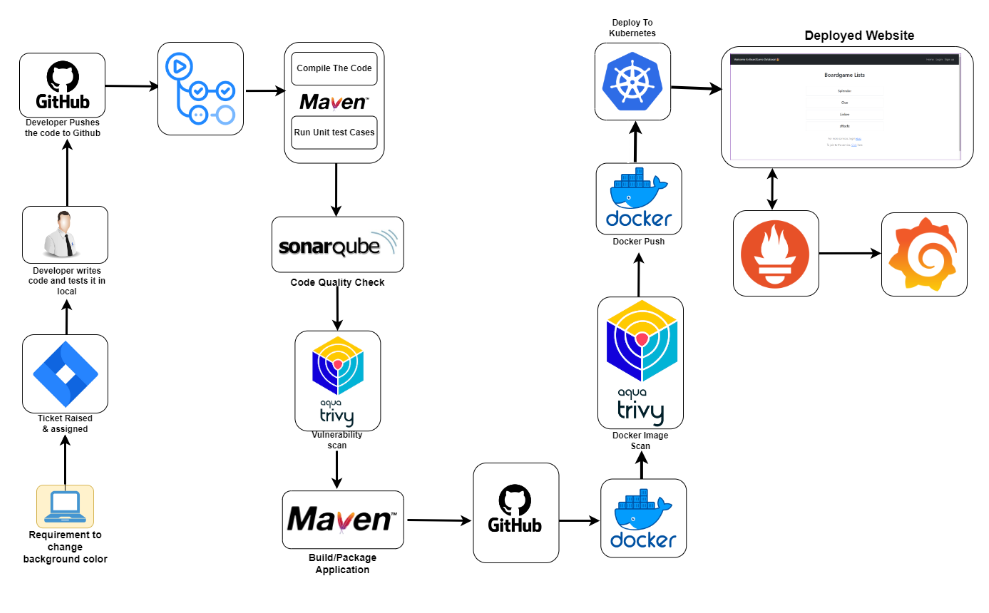

# Project Details

This project describes a comprehensive DevOps pipeline designed to automate software development, testing, deployment, and monitoring using modern tools and methodologies. The workflow begins with clients creating Jira or ServiceNow tickets to request new application features. Developers then write and test source code locally, ensuring functionality before pushing it to GitHub. Code changes are committed to feature branches, merged into the main branch after testing, and trigger GitHub Actions pipelines. These pipelines automate tasks such as code compilation and testing with Maven, code quality checks using SonarQube, and vulnerability scans with Aqua Trivy for both file systems and Docker images. The build process generates application artifacts, which are subsequently packaged into Docker images, scanned for vulnerabilities, and uploaded to Docker Hub.

The deployment phase involves creating Kubernetes (K8s) infrastructure, including a master and worker node setup on AWS EC2 instances. The project sets up Role-Based Access Control (RBAC) in Kubernetes to manage service account permissions for deployments. YAML manifests are used to deploy applications initially on a development cluster, and later on Amazon EKS. Monitoring is enabled using Prometheus and Grafana, with Blackbox Exporter for website-level monitoring and Node Exporter for system-level metrics. Alerts and dashboards provide real-time insights into application performance and infrastructure health.

The CI/CD pipeline is implemented with self-hosted GitHub runners, where key tools like Docker, SonarQube, Maven, and Trivy are pre-installed. Each pipeline stage is meticulously defined, from code cloning and JDK setup to artifact generation, Docker image creation, scanning, and deployment to Kubernetes. Monitoring dashboards in Grafana display metrics from Prometheus, sourced from Blackbox and Node exporters, enabling proactive infrastructure and application health management. This integrated approach ensures a seamless flow from development to production while maintaining high standards for code quality, security, and reliability.
GitHub CICD Pipeline

Grafana DashBoard showing the localhost health

BoardGame Home Page

Prometheus Target Health page for Blackbox,node and prometheus endpoints

SonarQube Project page for the BoardGame project

BlackBox Exporter page

NodeExporter Page 

# BoardgameListingWebApp Details

## Description

**Board Game Database Full-Stack Web Application.**
This web application displays lists of board games and their reviews. While anyone can view the board game lists and reviews, they are required to log in to add/ edit the board games and their reviews. The 'users' have the authority to add board games to the list and add reviews, and the 'managers' have the authority to edit/ delete the reviews on top of the authorities of users.  

## Technologies

- Java
- Spring Boot
- Amazon Web Services(AWS) EC2
- Thymeleaf
- Thymeleaf Fragments
- HTML5
- CSS
- JavaScript
- Spring MVC
- JDBC
- H2 Database Engine (In-memory)
- JUnit test framework
- Spring Security
- Twitter Bootstrap
- Maven

## Features

- Full-Stack Application
- UI components created with Thymeleaf and styled with Twitter Bootstrap
- Authentication and authorization using Spring Security
  - Authentication by allowing the users to authenticate with a username and password
  - Authorization by granting different permissions based on the roles (non-members, users, and managers)
- Different roles (non-members, users, and managers) with varying levels of permissions
  - Non-members only can see the boardgame lists and reviews
  - Users can add board games and write reviews
  - Managers can edit and delete the reviews
- Deployed the application on AWS EC2
- JUnit test framework for unit testing
- Spring MVC best practices to segregate views, controllers, and database packages
- JDBC for database connectivity and interaction
- CRUD (Create, Read, Update, Delete) operations for managing data in the database
- Schema.sql file to customize the schema and input initial data
- Thymeleaf Fragments to reduce redundancy of repeating HTML elements (head, footer, navigation)

## How to Run

1. Clone the repository
2. Open the project in your IDE of choice
3. Run the application
4. To use initial user data, use the following credentials.
  - username: bugs    |     password: bunny (user role)
  - username: daffy   |     password: duck  (manager role)
5. You can also sign-up as a new user and customize your role to play with the application! 😊
